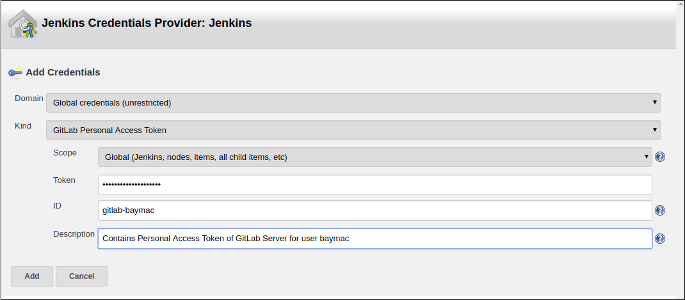
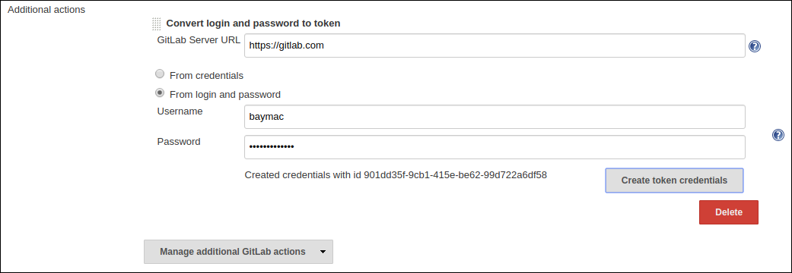

[](https://travis-ci.org/baymac/gitlab-branch-source-plugin)
[](https://github.com/jenkinsci/gitlab-branch-source-plugin/releases/latest)
[](https://gitter.im/jenkinsci/gitlab-branch-source-plugin)

# GitLab Branch Source Plugin

To be fully able to run a Jenkins Continuous Integration on a GitLab repository or project,
you require the following plugins:

1. [GitLab API Plugin](https://github.com/jenkinsci/gitlab-api-plugin) - Wraps GitLab Java API

2. GitLab Branch Source Plugin:

    Contains two packages:
 
     * `io.jenkins.plugins.gitlabserverconfig` - Manages server configuration and web hooks management. Ideally should reside inside
     another plugin with name `GitLab Plugin`. In future, this package will be moved into a new plugin.
     
     * `io.jenkins.plugins.gitlabbranchsource` - Adds GitLab Branch Source for Multi-branch Pipeline Jobs (including
     Merge Requests) and Folder organisation.

## Jenkins and GitLab Integration:

This section contains information about Jenkins CI support for GitLab.

### Present State

1. FreeStyle Job and Pipeline(Single Branch) Job are fully supported.

2. Multi-branch Pipeline Job is partially supported (no MRs detection).

3. GitLab Folder Organisation is not supported.

### Issues

1. The GitLab Java APIs are written within the plugin itself when it should be a different plugin.

2. Multi-branch Pipeline support is missing.

3. GitLab Folder Organisation for GitLab Projects is missing.

4. Convention for 3 separate plugin is not followed (e.g. - github-api-plugin, github-plugin, github-branch-source-plugin).

### Goals of this project

1. Implement a lightweight GitLab Plugin that depends on GitLab API Plugin.

2. Follow convention of 3 separate plugins i.e. `GitLab Plugin`, `GitLab API Plugin`, `GitLab Branch Source Plugin`.

3. Implement GitLab Branch Source Plugin with support for Multi-branch Pipeline Jobs.

4. Support new Jenkins features such as
[Jenkins Code as Configuration](https://github.com/jenkinsci/configuration-as-code-plugin) (JCasC),
[Incremental Tools](https://github.com/jenkinsci/incrementals-tools/).

5. Provide rich user experience.

6. Support all SCM Trait APIs.

7. Support Java 8 and above.

## Building the plugin

No binaries are available for this plugin as the plugin is in the very early alpha stage, and not ready for the general
public quite yet.  If you want to jump in early, you can try building it yourself from source.

### Installation:

1) Checkout out source code to your local machine:

     ```bash
     git clone https://github.com/baymac/gitlab-branch-source-plugin.git\
    
     cd gitlab-branch-source-plugin
     ```

2) Install the plugin:
    
    ```bash
    mvn clean install 
    ```
    or
    ```bash
    mvn clean install -DskipTests # to skip tests
    ```

3) Run the Plugin:

    ```bash
    mvn hpi:run # runs a Jenkins instance at localhost:8080
    ```
    
    or
    
    ```bash
    mvn hpi:run -Djetty.port={port} # to run on your desired port number 
    ```

    If you want to test it with your Jenkins server, after `mvn clean install` follow these steps in your Jenkins instance:
    
    1. Select `Manage Jenkins`
    
    2. Select `Manage Plugins`
    
    3. Select `Advanced` tab
    
    3. In `Upload Plugin` section, select `Choose file`
    
    4. Select `${root_dir}/target/gitlab-branch-source.hpi`
    
    5. Select `Upload` 
    
    6. Select `Install without restart`
    
## Getting Started

Jenkins is an open source, self hosting automation server for continuous integration and continuous delivery. The source
code of the core Jenkins and its plugins are written in Java. There have been development on a modern Jenkins Server
(see: [Blueocean Plugin](https://github.com/jenkinsci/blueocean-plugin)) using React and other modern front end tools
to provide rich user experience.

For more Jenkins related information, see [documentation](https://jenkins.io/doc/).

### Extending Jenkins 

Jenkins has more than a 1000 plugins so a vast set of functionality has already been implemented and this can be used
to leverage new plugins. Jenkins has an extensibility feature that allows plugin to use other plugins or core features
simply by extending their classes. To define or create an extension in Jenkins,we use the `@Extension` annotation
type. This annotation is picked up by Jenkins, and the new extension will be added to an `ExtensionList` object, where
the extension can then be found via `ExtensionFinder`.

### Running your Jenkins server:

Here are a few ways to setup your own Jenkins server:

1. Using a Jenkins docker:
    
    i. Download docker image from [here](https://hub.docker.com/r/jenkins/jenkins).
    
    ii. Open up a terminal/command prompt window to the download directory.
    
    iii. Run command:
    
    ```bash
    docker run \
      -u root \ 
      --rm \ 
      -d \ 
      -p 8080:8080 \ 
      -p 50000:50000 \ 
      -v jenkins-data:/var/jenkins_home \ 
      -v /var/run/docker.sock:/var/run/docker.sock \
	  --name jenkins \
      jenkinsci/blueocean 
    ```
    
    iv. Browse to `http://localhost:8080`.
    
    If you need more information about docker commands, see
    [here](https://jenkins.io/doc/book/installing/#on-macos-and-linux).
    
2. Using a Jenkins Web application Archive (WAR):

    i. Download [latest stable Jenkins WAR file](http://mirrors.jenkins.io/war-stable/latest/jenkins.war).
    
    ii. Open up a terminal/command prompt window to the download directory.
    
    iii. Run command:
    
    ```bash
    java -jar jenkins.war
    ```
    
    iv. Browse to `http://localhost:8080/jenkins`.
    
3. Using a Azure Jenkins solution:

    Refer to Azure [docs](https://docs.microsoft.com/en-us/azure/architecture/example-scenario/apps/jenkins).
   
4. Using a Bitnami Jenkins Stack:

    Refer to Bitnami [docs](https://docs.bitnami.com/general/apps/jenkins/).
    
### Post installation:

1. Unlock your Jenkins instance:

    i. From the Jenkins console log output, copy the automatically-generated alphanumeric password.
   
    ii. On the Unlock Jenkins page, paste this password into the Administrator password field and click `Continue`.
    
2. Customizing Jenkins with plugins

   Click one of the two options shown:
       
    i. `Install suggested plugins` - to install the recommended set of plugins, which are based on most common use cases.
       
    ii. `Select plugins to install` - to choose which set of plugins to initially install. When you first access the
    plugin selection page, the suggested plugins are selected by default.
    
3. Create an admin user

    i. When the Create First Admin User page appears, specify the details for your administrator user in the respective
    fields and click Save and Finish.
    
    ii. When the Jenkins is ready page appears, click Start using Jenkins.
    
    iii. If required, log in to Jenkins with the credentials of the user you just created and you are ready to start
    using Jenkins!

## Usage

Assuming plugin installation has been done already.

### Setting up GitLab Server Configuration on Jenkins

1. On jenkins, select `Manage Jenkins`

2. Select `Configure System`

3. Scroll down to find the `GitLab` section

   

4. Select `Add GitLab Server` | Select `GitLab Server`

5. Now you will now see the GitLab Server Configuration options
   
   
   
   There are 4 fields that needs to be configured:
       
    i. `Name` - Plugin automatically generates an unique server name for you. User may want to configure this field
    to suit their needs but should make sure it is sufficiently unique. We recommend to keep it as it is.
       
    ii. `Server URL` - Contains the URL to your GitLab Server. By default it is set to "https://gitlab.com". User can
    modify it to enter their GitLab Server URL e.g. https://gitlab.gnome.org/, http://gitlab.example.com:7990. etc.
    
    iii. `Credentials` - Contains a list of credentials entries that are of type GitLab Personal Access Token. When
    no credential has been added it shows "-none-". User can add a credential by clicking "Add" button.
    
    iv. `Web Hook` - This field is a checkbox. If you want the plugin to setup a webhook on your GitLab project(s)
    related jobs, check this box. The plugin listens to a URL for the concerned GitLab project(s) and when an event
    occurs in the GitLab Server, the server sends an event trigger to the URL where the web hook is setup. If you
    want continuous integration (or continuous delivery) on your GitLab project then you may want to automatically
    set it up.
     
6. Adding a Personal Access Token Credentials:

   This is a manual setup. To automatically generate Personal Access Token see
   [next section](#creating-personal-access-token-within-jenkins).

    i. User is required to add a `GitLab Personal Access Token` type credentials entry to securely persist the token
    inside Jenkins.

    ii. Generate a `Personal Access Token` on your GitLab Server:
        
        a. Select profile dropdown menu from top-right corner
        
        b. Select `Settings`
        
        c. Select `Access Token` from left column
        
        d. Enter a name | Set Scope to `api`,`read_user`, `read_repository`
        
        e. Select `Create Personal Access Token`
        
        f. Copy the token generated
        
    iii. Return to Jenkins | Select `Add` in Credentials field | Select `Jenkins`
    
    iv. Set `Kind` to GitLab Personal Access Token
    
    v. Enter `Token`
    
    vi. Enter a unique id in `ID`
    
    vii. Enter a human readable description
    
      
    
    viii. Select `Add`
    
7. Testing connection:

    i. Select your desired token in the `Credentials` dropdown
    
    ii. Select `Test Connection`
    
    iii. It should return something like `Credentials verified for user {username}`
    
8. Select `Apply` (at the bottom)

9. GitLab Server is now setup on Jenkins

#### Creating Personal Access Token within Jenkins

Alternatively, users can generate a GitLab Personal Access Token within Jenkins itself and automatically add the
GitLab Personal Access Token credentials to Jenkins server credentials. 

1. Select `Advanced` at the bottom of `GitLab` Section

2. Select `Manage Additional GitLab Actions`

3. Select `Convert login and password to token`

4. Set the `GitLab Server URL`

5. There are 2 options to generate token;

    i. `From credentials` - To select an already persisting Username Password Credentials or add an Username Password
    credential to persist it.
    
    ii. `From login and password` - If this is a one time thing then you can directly enter you credentials to the text boxes
    and the username/password credential is not persisted.
    
6. After setting your username/password credential, select `Create token credentials`.

7. The token creator will create a Personal Access Token in your GitLab Server for the given user with the
required scope and also create a credentials for the same inside Jenkins server. You can go back to the GitLab Server
Configuration to select the new credentials generated (select "-none-" first then new credentials will appear). For
security reasons this token is not revealed as plain text rather returns an `id`. It is a 128-bit long UUID-4 string
(36 characters).

   
   
### Configuration as Code

There is an easier way to setup GitLab Server configuration on your Jenkins server. No need for messing around in the UI.
`Jenkins Configuration as Code (JCasC)` or simply `Configuration as Code` Plugin allows you to configure Jenkins
via a `yaml` file. If you are a first time user, you can learn more about JCasC
[here](https://github.com/jenkinsci/configuration-as-code-plugin).

#### Prerequisite:

Installed `Configuration as Code` Plugin on your Jenkins instance.

Refer to [Installing a new plugin in Jenkins](https://jenkins.io/doc/book/managing/plugins/#installing-a-plugin).

#### Add configuration YAML:

There are multiple ways to load JCasC yaml file to configure Jenkins: 

* JCasC by default searches for a file with the name `jenkins.yaml` in `$JENKINS_ROOT`.

* The JCasC looks for an environment variable `CASC_JENKINS_CONFIG` which contains the path for the configuration `yaml` file.

    * A path to a folder containing a set of config files e.g. `/var/jenkins_home/casc_configs`.
    
    * A full path to a single file e.g. `/var/jenkins_home/casc_configs/jenkins.yaml`.
      
    * A URL pointing to a file served on the web e.g. `https://<your-domain>/jenkins.yaml`.

* You can also set the configuration yaml path in the UI. Go to `<your-jenkins-domain>/configuration-as-code`. Enter
path or URL to `jenkins.yaml` and select `Apply New Configuration`.

To configure your GitLab Server in Jenkins add the following to `jenkins.yaml`:

```yaml
credentials:
  system:
    domainCredentials:
      - credentials:
          - gitlabPersonalAccessToken:
              scope: SYSTEM
              id: "i<3GitLab"
              token: "XfsqZvVtAx5YCph5bq3r" # gitlab personal access token

unclassified:
  gitLabServers:
    servers:
      - credentialsId: "i<3GitLab"
        manageHooks: true
        name: "gitlab.com"
        serverUrl: "https://gitlab.com"
```

See handling secrets [section](https://github.com/jenkinsci/configuration-as-code-plugin#handling-secrets) in JCasC 
documentation for better security.

### Setting up GitLab for jobs

This section is a **Work in Progress**. Will be updated upon release.

## Issues

This project uses Jenkins [JIRA](https://issues.jenkins-ci.org/) to track issues. You can file issues under
`gitlab-branch-source-plugin` component.

## Acknowledgements

This plugin is built and maintained by the Google Summer of Code (GSoC) Team for
[Multi-branch Pipeline Support for GitLab](https://jenkins.io/projects/gsoc/2019/gitlab-support-for-multibranch-pipeline/).

The team consists of:

* [baymac](https://www.github.com/baymac) (Student)
* [LinuxSuRen](https://github.com/LinuxSuRen) (Mentor)
* [Marky](https://github.com/markyjackson-taulia) (Mentor)
* [Joseph](https://github.com/casz) (Mentor)
* [Justin](https://github.com/justinharringa) (Mentor)
* [Jeff](https://github.com/jeffpearce) (Mentor)

External Support:

* [Oleg](https://github.com/oleg-nenashev) (The org admin who helps with all technical issues)
* [Greg](https://github.com/gmessner) (The creator of GitLab4J APIs)
* [Stephen](https://github.com/stephenc) (The creator of SCM related Plugins)

Also thanks to entire Jenkins community for contributing with technical expertise and inspiration.
